# CCS - Claude Code Switch

<div align="center">


**One command, zero downtime, right model for each task**

Switch between Claude Sonnet 4.5 and GLM 4.6 instantly. Stop hitting rate limits. Start optimizing costs.


[](LICENSE)
[]()
[](https://www.npmjs.com/package/@kaitranntt/ccs)
[](https://claudekit.cc?ref=HMNKXOHN)

**Languages**: [English](README.md) | [Tiếng Việt](README.vi.md)

</div>

---

## 🚀 Quick Start

### 🔑 Prerequisites

**Before installing CCS, make sure you're logged into Claude CLI with your subscription account:**
```bash
claude /login
```

### Primary Installation Methods

#### Option 1: npm Package (Recommended)

**macOS / Linux / Windows**
```bash
npm install -g @kaitranntt/ccs
```

Compatible with npm, yarn, pnpm, and bun package managers.

#### Option 2: Direct Install (Traditional)

**macOS / Linux**
```bash
curl -fsSL ccs.kaitran.ca/install | bash
```

**Windows PowerShell**
```powershell
irm ccs.kaitran.ca/install | iex
```

### Your First Switch

```bash
# Use Claude subscription (default)
ccs "Review this architecture design"

# Switch to GLM for cost-optimized tasks
ccs glm "Create a simple REST API"

# Use GLM for all subsequent commands until switched back
ccs glm
ccs "Debug this issue"
ccs "Write unit tests"
```

#### Package Manager Options

All major package managers are supported:

```bash
# npm (default)
npm install -g @kaitranntt/ccs

# yarn
yarn global add @kaitranntt/ccs

# pnpm (70% less disk space)
pnpm add -g @kaitranntt/ccs

# bun (30x faster)
bun add -g @kaitranntt/ccs
```

### Configuration (Auto-created)

**CCS automatically creates configuration during installation** (via npm postinstall script).

**~/.ccs/config.json**:
```json
{
  "profiles": {
    "glm": "~/.ccs/glm.settings.json",
    "default": "~/.claude/settings.json"
  }
}
```

### Custom Claude CLI Path

If Claude CLI is installed in a non-standard location (D drive, custom directory), set `CCS_CLAUDE_PATH`:

```bash
export CCS_CLAUDE_PATH="/path/to/claude"              # Unix
$env:CCS_CLAUDE_PATH = "D:\Tools\Claude\claude.exe"   # Windows
```

**See [Troubleshooting Guide](./docs/troubleshooting.md#claude-cli-in-non-standard-location) for detailed setup instructions.**

---

## The Daily Developer Pain Point

You have both Claude subscription and GLM Coding Plan. Two scenarios happen every day:

1. **Rate Limits Hit**: Claude stops mid-project → you manually edit `~/.claude/settings.json`
2. **Cost Waste**: Simple tasks use expensive Claude → GLM would work fine

Manual switching breaks your flow. **CCS fixes it instantly**.

## Why CCS Instead of Manual Switching?

<div align="center">

| Feature | Benefit | Emotional Value |
|---------|---------|-----------------|
| **Instant Switching** | One command, no file editing | Confidence, control |
| **Zero Downtime** | Never interrupt your workflow | Reliability, consistency |
| **Smart Delegation** | Right model for each task automatically | Simplicity, ease |
| **Cost Control** | Use expensive models only when needed | Efficiency, savings |
| **Cross-Platform** | Works on macOS, Linux, Windows | Flexibility, portability |
| **Reliable** | Pure bash/PowerShell, zero dependencies | Trust, peace of mind |

</div>

**The Solution**:
```bash
ccs           # Use Claude subscription (default)
ccs glm       # Switch to GLM fallback
# Hit rate limit? Switch instantly:
ccs glm       # Continue working with GLM
```

One command. Zero downtime. No file editing. Right model, right task.

---

## 🏗️ Architecture Overview

```mermaid
graph LR
    subgraph "User Command"
        CMD[ccs glm]
    end

    subgraph "CCS Processing"
        CONFIG[Read ~/.ccs/config.json]
        LOOKUP[Lookup profile → settings file]
        VALIDATE[Validate file exists]
    end

    subgraph "Claude CLI"
        EXEC[claude --settings file_path]
    end

    subgraph "API Response"
        API[Claude Sub or GLM API]
    end

    CMD --> CONFIG
    CONFIG --> LOOKUP
    LOOKUP --> VALIDATE
    VALIDATE --> EXEC
    EXEC --> API
```



---

## ⚡ Features

### Instant Profile Switching
- **One Command**: `ccs glm` to switch to GLM, `ccs` to use Claude subscription - no config file editing
- **Smart Detection**: Automatically uses right model for each task
- **Persistent**: Switch stays active until changed again

### Zero Workflow Interruption
- **No Downtime**: Switching happens instantly between commands
- **Context Preservation**: Your workflow remains uninterrupted
- **Seamless Integration**: Works exactly like native Claude CLI

### Task Delegation

> **🚧 Work in Progress**: This feature is experimental and not fully tested. Use with caution.

CCS includes intelligent task delegation via the `/ccs` meta-command:

**Install CCS commands:**
```bash
ccs --install    # Install /ccs command to Claude CLI
```

**Use task delegation:**
```bash
# After running ccs --install, you can use:
/ccs glm /plan "add user authentication"
/ccs glm /code "implement auth endpoints"
/ccs glm /ask "explain this error"
```

**Remove when not needed:**
```bash
ccs --uninstall  # Remove /ccs command from Claude CLI
```

**Benefits**:
- ✅ Save tokens by delegating simple tasks to cheaper models
- ✅ Use right model for each task automatically
- ✅ Seamless integration with existing workflows
- ✅ Clean installation and removal when needed

---

## 💻 Usage Examples

```bash
ccs              # Use Claude subscription (default)
ccs glm          # Use GLM fallback
ccs --version    # Show CCS version and install location
ccs --install    # Install CCS commands and skills to ~/.claude/
ccs --uninstall  # Remove CCS commands and skills from ~/.claude/
```

---

### 🗑️ Uninstall

**macOS / Linux**:
```bash
curl -fsSL ccs.kaitran.ca/uninstall | bash
```

**Windows PowerShell**:
```powershell
irm ccs.kaitran.ca/uninstall | iex
```

---

## 🎯 Philosophy

- **YAGNI**: No features "just in case"
- **KISS**: Simple bash, no complexity
- **DRY**: One source of truth (config)

---

## 📖 Documentation

**Complete documentation in [docs/](./docs/)**:
- [Installation Guide](./docs/installation.md)
- [Configuration](./docs/configuration.md)
- [Usage Examples](./docs/usage.md)
- [Troubleshooting](./docs/troubleshooting.md)
- [Contributing](./docs/contributing.md)

---

## 🤝 Contributing

We welcome contributions! Please see our [Contributing Guide](./docs/contributing.md) for details.

---

## 📄 License

CCS is licensed under the [MIT License](LICENSE).

---

<div align="center">

**Made with ❤️ for developers who hit rate limits too often**

[⭐ Star this repo](https://github.com/kaitranntt/ccs) | [🐛 Report issues](https://github.com/kaitranntt/ccs/issues) | [📖 Read docs](./docs/)

</div>