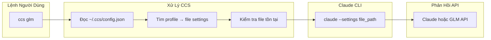

# CCS - Claude Code Switch

<div align="center">


**Một lệnh, không downtime, đúng model cho từng tác vụ**

Chuyển đổi giữa Claude Sonnet 4.5 và GLM 4.6 ngay lập tức. Ngừng hitting rate limits. Bắt đầu tối ưu chi phí.


[](LICENSE)
[]()
[](https://claudekit.cc?ref=HMNKXOHN)

**Ngôn ngữ**: [English](README.md) | [Tiếng Việt](README.vi.md)

</div>

---

## 🚀 Bắt Đầu Nhanh

### 🔑 Điều Kiện Tiên Quyết

**Trước khi cài đặt CCS, hãy đảm bảo bạn đã đăng nhập vào Claude CLI với tài khoản subscription:**
```bash
claude /login
```

### Phương Pháp Cài Đặt Chính

#### Option 1: npm Package (Được khuyến nghị)

**macOS / Linux / Windows**
```bash
npm install -g @kaitranntt/ccs
```

Tương thích với các trình quản lý package npm, yarn, pnpm, và bun.

#### Option 2: Cài Đặt Trực Tiếp (Truyền thống)

**macOS / Linux**
```bash
curl -fsSL ccs.kaitran.ca/install | bash
```

**Windows PowerShell**
```powershell
irm ccs.kaitran.ca/install | iex
```

### Lần Chuyển Đổi Đầu Tiên

```bash
# Dùng Claude subscription (mặc định)
ccs "Review thiết kế kiến trúc này"

# Chuyển sang GLM cho tác vụ tối ưu chi phí
ccs glm "Tạo REST API đơn giản"

# Dùng GLM cho tất cả lệnh tiếp theo cho đến khi chuyển lại
ccs glm
ccs "Debug issue này"
ccs "Viết unit tests"
```

#### Package Manager Options

Tất cả các trình quản lý package chính đều được hỗ trợ:

```bash
# npm (mặc định)
npm install -g @kaitranntt/ccs

# yarn
yarn global add @kaitranntt/ccs

# pnpm (ít hơn 70% dung lượng đĩa)
pnpm add -g @kaitranntt/ccs

# bun (nhanh hơn 30x)
bun add -g @kaitranntt/ccs
```

### Cấu Hình (Tự Tạo)

**CCS tự động tạo cấu hình trong quá trình cài đặt** (thông qua script postinstall của npm).

**~/.ccs/config.json**:
```json
{
  "profiles": {
    "glm": "~/.ccs/glm.settings.json",
    "default": "~/.claude/settings.json"
  }
}
```

### Đường Dẫn Claude CLI Tùy Chỉnh

Nếu Claude CLI được cài đặt ở vị trí không chuẩn (ổ D, thư mục tùy chỉnh), đặt `CCS_CLAUDE_PATH`:

```bash
export CCS_CLAUDE_PATH="/path/to/claude"              # Unix
$env:CCS_CLAUDE_PATH = "D:\Tools\Claude\claude.exe"   # Windows
```

**Xem [Hướng dẫn Khắc phục Sự cố](./docs/vi/troubleshooting.vi.md#claude-cli-ở-vị-trí-không-chuẩn) để biết chi tiết cài đặt.**

---

## Điểm Đau Hàng Ngày Của Lập Trình Viên

Bạn có cả Claude subscription và GLM Coding Plan. Hai tình huống xảy ra hàng ngày:

1. **Hết Rate Limit**: Claude dừng giữa chừng project → bạn phải tự tay sửa `~/.claude/settings.json`
2. **Lãng Phí Chi Phí**: Tác vụ đơn giản dùng Claude đắt tiền → GLM cũng làm tốt

Chuyển đổi thủ công làm gián đoạn workflow của bạn. **CCS khắc phục ngay lập tức**.

## Tại Sao CCS Thay Vì Chuyển Đổi Thủ Công?

<div align="center">

| Tính năng | Lợi ích | Giá trị cảm xúc |
|-----------|---------|-----------------|
| **Chuyển đổi tức thì** | Một lệnh, không sửa file | Tự tin, kiểm soát |
| **Không downtime** | Không bao giờ gián đoạn workflow | Đáng tin cậy, nhất quán |
| **Delegation thông minh** | Đúng model cho từng tác vụ tự động | Đơn giản, dễ dàng |
| **Kiểm soát chi phí** | Dùng model đắt tiền chỉ khi cần | Hiệu quả, tiết kiệm |
| **Đa nền tảng** | Hoạt động trên macOS, Linux, Windows | Linh hoạt, di động |
| **Đáng tin cậy** | Bash/PowerShell thuần, không dependencies | Tin tưởng, an tâm |

</div>

**Giải pháp**:
```bash
ccs           # Dùng Claude subscription (mặc định)
ccs glm       # Chuyển sang GLM fallback
# Hết rate limit? Chuyển ngay:
ccs glm       # Tiếp tục làm việc với GLM
```

Một lệnh. Không downtime. Không phải sửa file. Đúng model, đúng việc.

---

## 🏗️ Tổng Quan Kiến Trúc



---

## ⚡ Tính Năng

### Chuyển Profile Ngay Lập Tức
- **Một Lệnh**: `ccs glm` để chuyển sang GLM, `ccs` để dùng Claude subscription - không cần sửa file config
- **Phát Hiện Thông Minh**: Tự động dùng đúng model cho từng tác vụ
- **Liên Tục**: Chuyển đổi hoạt động cho đến khi thay đổi lại

### Không Gián Đoạn Workflow
- **Không Downtime**: Chuyển đổi xảy ra ngay lập tức giữa các lệnh
- **Bảo Toàn Context**: Workflow của bạn không bị gián đoạn
- **Tích Hợp Liền Mạch**: Hoạt động chính xác như Claude CLI native

### Delegation Tác Vụ

> **🚧 Đang phát triển**: Tính năng này đang trong giai đoạn thử nghiệm và chưa được kiểm tra đầy đủ. Sử dụng với cẩn thận.

CCS bao gồm delegation tác vụ thông minh qua meta-command `/ccs`:

**Cài đặt lệnh CCS:**
```bash
ccs --install    # Cài đặt lệnh /ccs vào Claude CLI
```

**Sử dụng delegation tác vụ:**
```bash
# Sau khi chạy ccs --install, bạn có thể dùng:
/ccs glm /plan "add user authentication"
/ccs glm /code "implement auth endpoints"
/ccs glm /ask "explain this error"
```

**Gỡ bỏ khi không cần:**
```bash
ccs --uninstall  # Gỡ bỏ lệnh /ccs khỏi Claude CLI
```

**Lợi ích**:
- ✅ Tiết kiệm tokens bằng cách delegation tác vụ đơn giản cho model rẻ hơn
- ✅ Dùng đúng model cho từng tác vụ tự động
- ✅ Tích hợp liền mạch với workflows hiện có
- ✅ Cài đặt và gỡ bỏ sạch sẽ khi cần

---

## 💻 Ví Dụ Sử Dụng

```bash
ccs              # Dùng Claude subscription (mặc định)
ccs glm          # Dùng GLM fallback
ccs --version    # Hiển thị phiên bản CCS và vị trí cài đặt
ccs --install    # Cài đặt lệnh và kỹ năng CCS vào ~/.claude/
ccs --uninstall  # Gỡ bỏ lệnh và kỹ năng CCS khỏi ~/.claude/
```

---

### 🗑️ Gỡ Cài Đặt

**macOS / Linux**:
```bash
curl -fsSL ccs.kaitran.ca/uninstall | bash
```

**Windows PowerShell**:
```powershell
irm ccs.kaitran.ca/uninstall | iex
```

---

## 🎯 Triết Lý

- **YAGNI**: Không có tính năng "phòng hờ"
- **KISS**: Bash đơn giản, không phức tạp
- **DRY**: Một nguồn chân lý duy nhất (config)

---

## 📖 Tài Liệu

**Tài liệu đầy đủ trong [docs/](./docs/)**:
- [Hướng dẫn Cài đặt](./docs/installation.md)
- [Cấu hình](./docs/configuration.md)
- [Ví dụ Sử dụng](./docs/usage.md)
- [Khắc phục Sự cố](./docs/troubleshooting.md)
- [Đóng góp](./docs/contributing.md)

---

## 🤝 Đóng Góp

Chúng tôi chào mừng đóng góp! Vui lòng xem [Hướng dẫn Đóng góp](./docs/contributing.md) để biết chi tiết.

---

## 📄 Giấy Phép

CCS được cấp phép theo [Giấy phép MIT](LICENSE).

---

<div align="center">

**Được tạo với ❤️ cho những lập trình viên hay hết rate limit**

[⭐ Star repo này](https://github.com/kaitranntt/ccs) | [🐛 Báo cáo vấn đề](https://github.com/kaitranntt/ccs/issues) | [📖 Đọc tài liệu](./docs/)

</div>
