# CCS System Architecture

## Overview

CCS (Claude Code Switch) is a lightweight CLI wrapper that provides instant profile switching between Claude Sonnet 4.5, GLM 4.6, GLMT (GLM with Thinking), and Kimi for Coding models. Current version **v4.5.0** features AI-powered delegation system, selective .claude/ directory symlinking, stream-JSON output, shell completion (4 shells), and comprehensive diagnostics (doctor, sync, update commands). v4.5.0 completes transition to Node.js-first architecture with bootstrap-based installers.

## Core Architecture Principles

### Design Philosophy
- **YAGNI** (You Aren't Gonna Need It): No features "just in case"
- **KISS** (Keep It Simple): Minimal complexity, maximum reliability
- **DRY** (Don't Repeat Yourself): Single source of truth for each concern

### Simplification Goals
- Consolidate duplicate logic into reusable functions
- Remove unnecessary validation layers ("security theater")
- Simplify error handling and messaging
- Maintain cross-platform compatibility

## High-Level Architecture (v4.3.2)

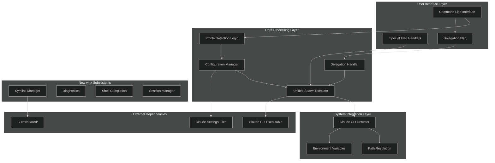

## Component Architecture

### 1. Main Entry Point (`src/ccs.ts` - 593 lines, Phase 02 Refactored)

**Role**: Central orchestrator for all CCS operations (Post-Phase 02 modular architecture)

**Key Responsibilities**:
- Argument parsing and profile detection
- **Command routing to modular handlers** (Phase 02 enhancement)
- Delegation detection (`-p` / `--prompt` flag routing)
- Profile type routing (settings-based vs account-based)
- GLMT proxy lifecycle management
- Unified process execution through `execClaude()`
- Error propagation and exit code management
- Auto-recovery for missing configuration

**Phase 02 Refactoring Achievement**:
- **Size reduction**: 1,071 → 593 lines (**44.6% reduction**)
- **Modularization**: 6 command handlers extracted to dedicated modules
- **Maintainability**: Single responsibility principle applied to all commands
- **Focus**: Now contains only core routing, profile detection, and GLMT proxy logic

**Architecture with Delegation Support (v4.3.2)**:
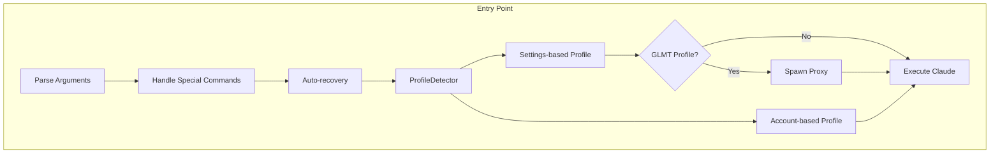

**Key Enhancements**:
- **v3.3.0**: GLMT proxy spawning with verbose flag detection, API key validation, 5s timeout
- **v3.2.0**: Dual-path execution supporting both `--settings` flag (backward compatible) and `CLAUDE_CONFIG_DIR` env var (concurrent sessions)
- **v3.1.0**: Auto-recovery manager for missing configs

**GLMT-Specific Logic**:
```javascript
// Check if GLMT profile
if (profileInfo.name === 'glmt') {
  // 1. Read API key from settings
  // 2. Spawn proxy with --verbose flag (if detected in args)
  // 3. Wait for PROXY_READY:port signal (5s timeout)
  // 4. Spawn Claude CLI with proxy URL
  // 5. Kill proxy when Claude exits
  await execClaudeWithProxy(claudeCli, 'glmt', remainingArgs);
}
```

### 2. Configuration Manager (`bin/config-manager.js`)

**Role**: Handles all configuration-related operations

**Key Responsibilities**:
- Configuration file path resolution
- JSON parsing and validation
- Profile-to-settings-file mapping
- Error handling for configuration issues

**Architecture Flow**:
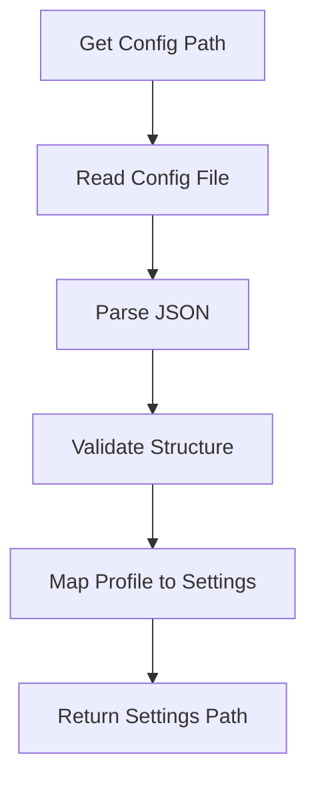

**Simplified Validation**: Removed redundant validation functions while maintaining essential checks for file existence and JSON validity.

### 3. Claude CLI Detector (`bin/claude-detector.js`)

**Role**: Locates and validates the Claude CLI executable

**Key Responsibilities**:
- Environment variable override support (`CCS_CLAUDE_PATH`)
- System PATH resolution
- Cross-platform executable detection
- Windows-specific executable extension handling

**Detection Priority**:
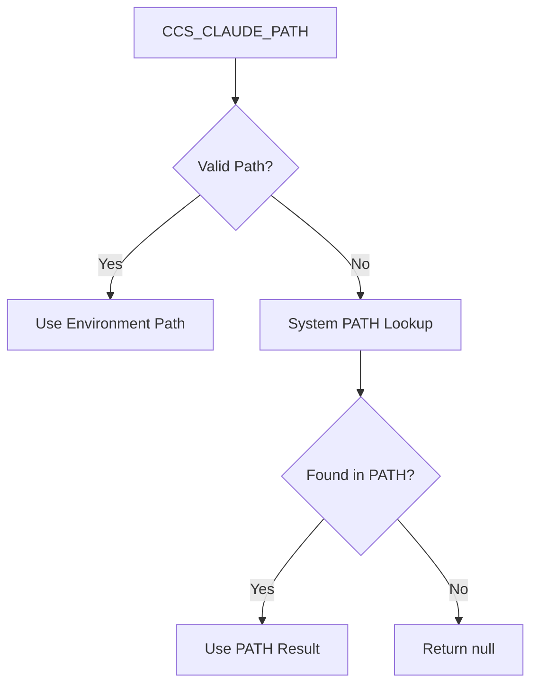

**Platform-Specific Logic**:
- **Unix/macOS**: Uses `which claude` command
- **Windows**: Uses `where.exe claude` with extension preference
- **Cross-platform**: Unified error handling and fallback logic

### 4. Helpers Module (`bin/helpers.js`)

**Role**: Provides essential utility functions

**Key Responsibilities**:
- TTY-aware color formatting
- Path expansion with tilde and environment variables
- Simplified error reporting
- Cross-platform compatibility

**Removed Functions** (Security Theater):
- `escapeShellArg()`: Unnecessary with spawn() arrays
- `validateProfileName()`: Redundant validation
- `isPathSafe()`: Excessive security checking

### 5. Instance Manager (`bin/instance-manager.js`) - NEW in 

**Role**: Manages isolated Claude CLI instances per profile

**Key Responsibilities**:
- Lazy instance initialization on first use (YAGNI principle)
- Instance directory creation (`~/.ccs/instances/<profile>/`)
- Credential synchronization from vault to instance
- Instance integrity validation
- Instance lifecycle management (create, validate, delete)

**Architecture Flow**:
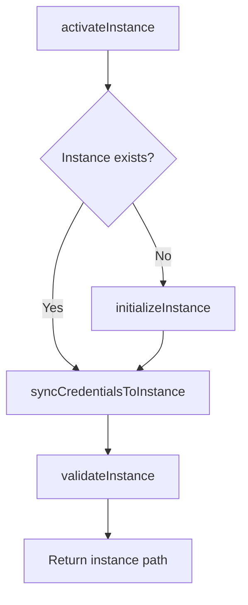

**Directory Structure Created**:
```
~/.ccs/instances/<profile>/
├── session-env/           # Claude session data
├── todos/                 # Per-profile todo lists
├── logs/                  # Execution logs
├── file-history/          # File edit history
├── shell-snapshots/       # Shell state snapshots
├── debug/                 # Debug information
├── .anthropic/            # Anthropic SDK config
├── commands/              # Custom commands (copied from global)
├── skills/                # Custom skills (copied from global)
└── .credentials.json      # Encrypted credentials (synced from vault)
```

### 6. Profile Detector (`bin/profile-detector.js`) - NEW in 

**Role**: Determines profile type for routing

**Key Responsibilities**:
- Detect settings-based profiles (glm, kimi) - Priority 1 for backward compatibility
- Detect account-based profiles (work, personal) - Priority 2
- Resolve default profile across both types
- Provide error messages with available profiles

**Detection Priority**:
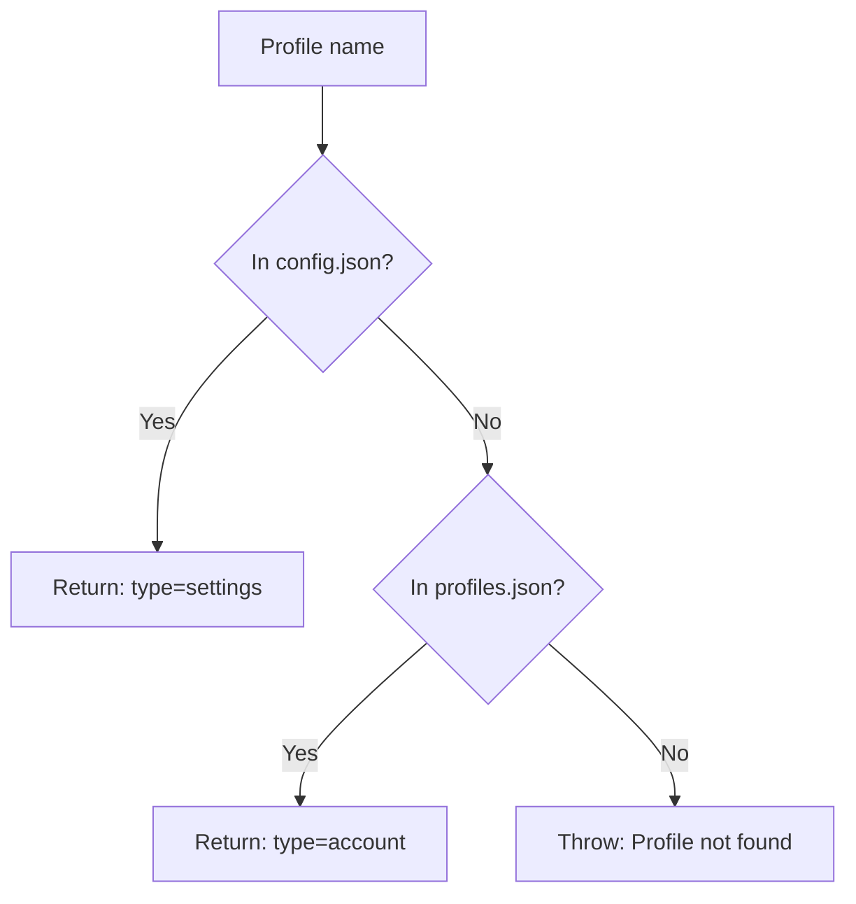

### 7. Profile Registry (`bin/profile-registry.js`) - NEW in 

**Role**: Manages account profile metadata

**Key Responsibilities**:
- CRUD operations for account profiles in `~/.ccs/profiles.json`
- Default profile management
- Last-used timestamp tracking
- Atomic file writes for data integrity

**Profile Metadata Schema**:
```json
{
  "version": "2.0.0",
  "profiles": {
    "work": {
      "type": "account",
      "vault": "~/.ccs/accounts/work.json.enc",
      "subscription": "pro",
      "email": "user@work.com",
      "created": "2025-11-09T...",
      "last_used": "2025-11-09T..."
    }
  },
  "default": "work"
}
```
## Modular Command Architecture (Phase 02, 2025-11-27)

### Overview

The modular command architecture separates command handling logic from the main orchestrator, achieving significant improvements in maintainability, testability, and code organization.

### Components

**Command Handler Modules** (`src/commands/`):

**1. Version Command Handler (`src/commands/version-command.ts` - 3.0KB)**
- Handles `--version` flag display
- Shows version number, build location, and platform information
- Delegates version formatting and display logic from main file

**2. Help Command Handler (`src/commands/help-command.ts` - 4.9KB)**
- Handles `--help` flag display
- Provides comprehensive help including profile listings
- Supports delegation help with usage examples
- Dynamically generates help content based on available profiles

**3. Install Command Handler (`src/commands/install-command.ts` - 957B)**
- Handles `--install` flag for setup instructions
- Manages installation and uninstallation workflows
- Cross-platform compatibility support

**4. Doctor Command Handler (`src/commands/doctor-command.ts` - 415B)**
- Handles `doctor` subcommand for system diagnostics
- Validates installation, configuration, and profile status
- Provides health check functionality

**5. Sync Command Handler (`src/commands/sync-command.ts` - 1.0KB)**
- Handles `sync` subcommand for configuration synchronization
- Repairs broken symlinks and directory structures
- Maintains shared data consistency

**6. Shell Completion Command Handler (`src/commands/shell-completion-command.ts` - 2.1KB)**
- Handles `--shell-completion` flag and `-sc` alias
- Installs shell completion scripts for Bash, Zsh, Fish, PowerShell
- Manages shell-specific completion logic

**New Utility Modules** (`src/utils/`):

**1. Shell Executor (`src/utils/shell-executor.ts` - 1.5KB)**
- Cross-platform shell command execution utilities
- Handles process spawning, signal management, and output capture
- Provides consistent shell interface across platforms

**2. Package Manager Detector (`src/utils/package-manager-detector.ts` - 3.8KB)**
- Detects available package managers (npm, yarn, pnpm, bun)
- Cross-platform package manager identification
- Supports installation and update workflows

### Modular Architecture Flow

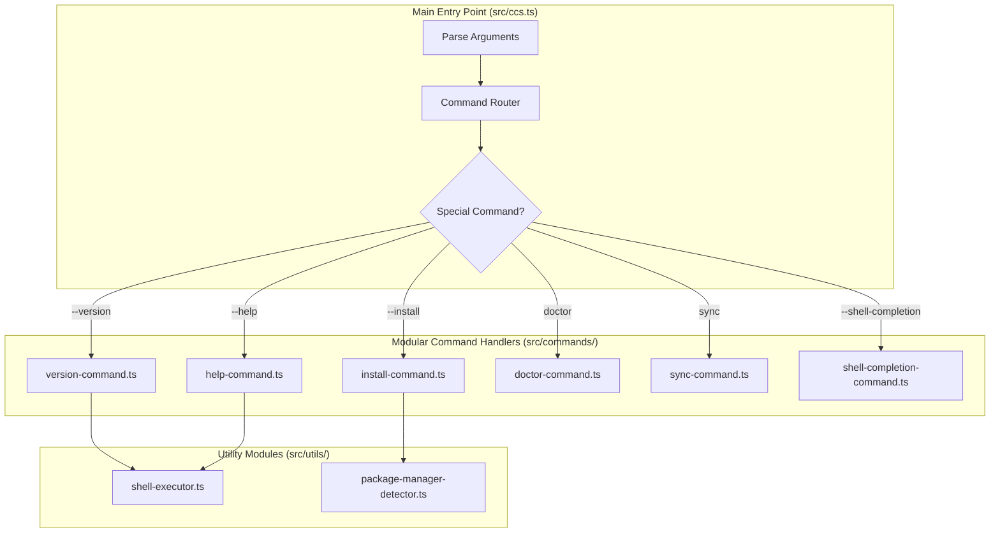

### Phase 02 Benefits Achieved

**Maintainability Improvements:**
- **Single Responsibility**: Each command has focused, dedicated module
- **Code Navigation**: Developers can quickly locate specific command logic
- **Testing Independence**: Command handlers can be unit tested in isolation
- **Reduced Complexity**: Main file focuses on orchestration only

**Development Workflow Enhancements:**
- **Parallel Development**: Multiple developers can work on different commands simultaneously
- **Feature Isolation**: Changes to one command don't affect others
- **Code Review Efficiency**: Smaller, focused pull requests for command modifications
- **Debugging Simplification**: Issues can be isolated to specific command modules

**Architecture Scalability:**
- **Easy Extension**: New commands can be added without modifying main orchestrator
- **Consistent Patterns**: All command handlers follow established patterns
- **Type Safety**: Comprehensive TypeScript coverage across all modules
- **Performance**: No performance degradation, minor improvement due to smaller main file

### Command Handler Interface Pattern

All command handlers follow a consistent interface pattern:

```typescript
interface CommandHandler {
  handle(args: string[]): Promise<void>;
  requiresProfile?: boolean;
  description?: string;
}
```

This standardized interface ensures:
- **Consistent API**: All commands can be called uniformly
- **Type Safety**: TypeScript ensures proper argument handling
- **Future Extension**: New commands can easily conform to the pattern
- **Testing**: Mock interfaces can be created for unit testing

## Delegation Architecture (v4.0+)

### Overview

The delegation system enables headless execution of Claude CLI with real-time tool tracking. Users invoke with `-p` flag for AI-powered task delegation.

### Components

**1. Delegation Handler (`bin/delegation/delegation-handler.js` - ~300 lines)**
- Routes `-p` commands to appropriate profile
- Validates profile has valid API key
- Detects `:continue` suffix for session resumption
- Delegates to HeadlessExecutor for execution

**2. Headless Executor (`bin/delegation/headless-executor.js` - ~400 lines)**
- Spawns Claude CLI with `--output-format stream-json --verbose`
- Parses stream-JSON output in real-time
- Tracks 13+ Claude Code tools (Bash, Read, Write, Edit, Glob, Grep, etc.)
- Handles Ctrl+C signal (kills child processes properly)
- Extracts cost and duration from output

**3. Session Manager (`bin/delegation/session-manager.js` - ~200 lines)**
- Saves session IDs for continuation support
- Loads last session for `:continue` commands
- Manages session history in `~/.ccs/delegation-sessions/`

**4. Result Formatter (`bin/delegation/result-formatter.js` - ~150 lines)**
- Formats execution results with cost, duration, exit code
- Color-codes tool names and paths
- Displays summary statistics

**5. Settings Parser (`bin/delegation/settings-parser.js` - ~150 lines)**
- Parses profile settings to extract API keys
- Validates settings file format
- Supports both settings-based and account-based profiles

### Delegation Execution Flow

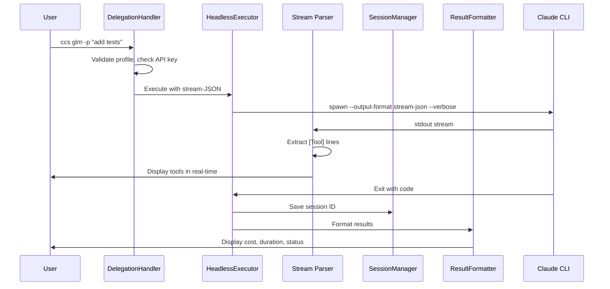

### Stream-JSON Parsing

**Tool Tracking**:
```javascript
// Real-time extraction of tool calls from stream-JSON
const toolRegex = /\[Tool\]\s+(\w+)\((.*?)\)/;
const match = line.match(toolRegex);
if (match) {
  const [_, toolName, params] = match;
  console.log(`  ${formatToolName(toolName)} ${formatParams(params)}`);
}
```

**Supported Tools** (13+):
- Bash, BashOutput, KillShell
- Read, Write, Edit, MultiEdit, NotebookEdit
- Glob, Grep
- WebFetch, WebSearch
- SlashCommand, Skill, TodoWrite

### Session Continuation

**Usage**:
```bash
# Initial delegation
ccs glm -p "add tests"
# Session saved to ~/.ccs/delegation-sessions/glm-last.json

# Continue session
ccs glm:continue -p "run the tests"
# Loads session ID, continues conversation
```

**Session Storage** (`~/.ccs/delegation-sessions/`):
```json
{
  "profile": "glm",
  "sessionId": "2a3b4c5d",
  "timestamp": "2025-11-21T10:00:00.000Z",
  "prompt": "add tests"
}
```

## .claude/ Symlinking Architecture (v4.1+)

### Overview

CCS selectively symlinks .claude/ directories to share data (commands, skills, agents) across profiles while keeping profile-specific data isolated (settings, sessions, logs).

### Components

**1. Claude Directory Installer (`bin/utils/claude-dir-installer.js` - ~300 lines)**
- Creates `~/.ccs/shared/` directory structure
- Installs shared directories: commands/, skills/, agents/
- Non-invasive: never modifies `~/.claude/settings.json`
- Idempotent: safe to run multiple times

**2. Claude Symlink Manager (`bin/utils/claude-symlink-manager.js` - ~400 lines)**
- Creates symlinks from instance .claude/ to `~/.ccs/shared/`
- Windows fallback: copies directories if symlinks unavailable
- Validates symlink integrity
- Repairs broken symlinks via `ccs sync`

### Symlinking Strategy

**Symlinked (Shared)**:
- `~/.ccs/instances/work/.claude/commands/` → `~/.ccs/shared/commands/`
- `~/.ccs/instances/work/.claude/skills/` → `~/.ccs/shared/skills/`
- `~/.ccs/instances/work/.claude/agents/` → `~/.ccs/shared/agents/`

**Isolated (Profile-Specific)**:
- `~/.ccs/instances/work/.claude/settings.json`
- `~/.ccs/instances/work/.claude/sessions/`
- `~/.ccs/instances/work/.claude/todolists/`
- `~/.ccs/instances/work/.claude/logs/`

### Directory Structure

```
~/.ccs/
├── shared/                    # Shared across all profiles (v4.1+)
│   ├── commands/              # Slash commands
│   ├── skills/                # Agent skills
│   └── agents/                # Agent configs
└── instances/
    ├── work/
    │   └── .claude/
    │       ├── commands@ → ~/.ccs/shared/commands/   # Symlink
    │       ├── skills@ → ~/.ccs/shared/skills/       # Symlink
    │       ├── agents@ → ~/.ccs/shared/agents/       # Symlink
    │       ├── settings.json                          # Isolated
    │       ├── sessions/                              # Isolated
    │       └── logs/                                  # Isolated
    └── personal/
        └── .claude/
            ├── commands@ → ~/.ccs/shared/commands/
            ├── skills@ → ~/.ccs/shared/skills/
            ├── agents@ → ~/.ccs/shared/agents/
            ├── settings.json
            ├── sessions/
            └── logs/
```

### Windows Fallback

When symlinks unavailable on Windows:
1. Copy directories instead of symlinking
2. `ccs sync` updates copies from `~/.ccs/shared/`
3. Less efficient but maintains functionality

## Shell Completion Architecture (v4.1.4+)

### Overview

CCS provides comprehensive shell completion for 4 shells (Bash, Zsh, Fish, PowerShell) with color-coded categories and profile-aware completions.

### Components

**1. Completion Generator (`bin/utils/shell-completion.js` - ~500 lines)**
- Generates completion scripts for each shell
- Color-codes categories: profiles (blue), commands (green), flags (yellow)
- Profile-aware: reads `config.json` and `profiles.json` dynamically
- Easy installation via `ccs --shell-completion <shell>`

### Supported Shells

| Shell | Completion File | Location |
|-------|----------------|----------|
| Bash | `ccs-completion.bash` | `~/.bashrc` |
| Zsh | `_ccs` | `~/.zshrc` or fpath |
| Fish | `ccs.fish` | `~/.config/fish/completions/` |
| PowerShell | `ccs-completion.ps1` | PowerShell profile |

### Color-Coded Categories

**Profiles** (Blue):
- glm, glmt, kimi (settings-based)
- work, personal (account-based)

**Commands** (Green):
- auth, doctor, sync, update

**Flags** (Yellow):
- --version, --help, --shell-completion, -p

## Diagnostics Architecture (v4.2+)

### Overview

CCS provides comprehensive health diagnostics and maintenance commands.

### Components

**1. Doctor Command (`bin/management/doctor.js` - ~300 lines)**
- Validates installation
- Checks profiles and API keys
- Verifies symlink integrity
- Displays color-coded status ([OK], [!], [X])

**2. Sync Command (`bin/management/sync.js` - ~200 lines)**
- Repairs broken symlinks
- Fixes directory structure
- Updates shared data

**3. Update Checker (`bin/utils/update-checker.js` - ~150 lines)**
- Checks for newer CCS versions
- Smart notifications (once per day)
- Displays upgrade instructions

## GLMT Architecture (v3.2.0+)

### Overview

GLMT (GLM with Thinking) uses an embedded HTTP proxy to enable thinking mode support for GLM 4.6. The proxy converts between Anthropic and OpenAI formats, injecting reasoning parameters and transforming `reasoning_content` into thinking blocks.

### Components

**1. GLMT Transformer (`bin/glmt-transformer.js`)**
- Converts Anthropic Messages API → OpenAI Chat Completions format
- Extracts thinking control tags: `<Thinking:On|Off>`, `<Effort:Low|Medium|High>` (effort deprecated)
- Injects reasoning parameters: `reasoning: true` (binary only - Z.AI constraint)
- Transforms OpenAI `reasoning_content` → Anthropic thinking blocks
- Generates thinking signatures for Claude Code UI
- Debug logging to `~/.ccs/logs/` when `CCS_DEBUG_LOG=1`

**Control Mechanisms** (v3.6):
- **Locale enforcer** (`bin/locale-enforcer.js`): Force English output (prevents Chinese responses)
- **Budget calculator** (`bin/budget-calculator.js`): Thinking on/off based on task type + budget
- **Task classifier** (`bin/task-classifier.js`): Classify reasoning vs execution tasks
- **Loop detection** (`bin/delta-accumulator.js`): Break unbounded planning loops (3 blocks)

**2. GLMT Proxy (`bin/glmt-proxy.js`)**
- Embedded HTTP server on `127.0.0.1:random_port`
- Intercepts Claude CLI → Z.AI requests
- Lifecycle tied to parent process
- Buffered mode only (streaming not supported)
- Request timeout: 120s default

### GLMT Execution Flow

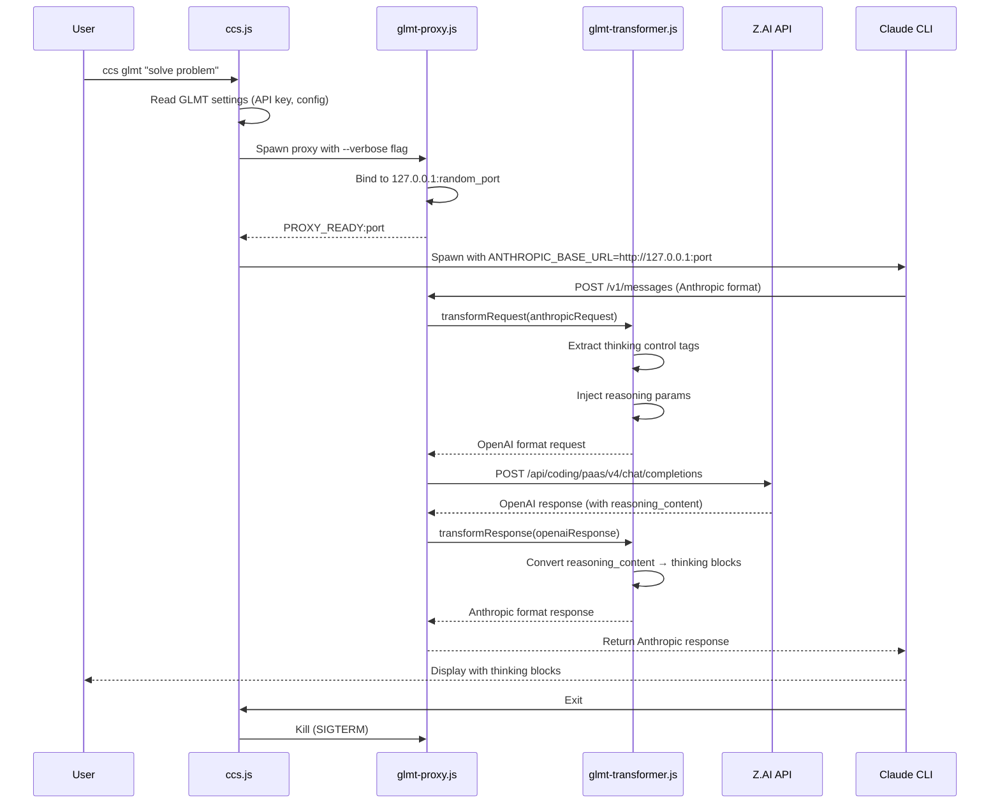

### Debug Mode Architecture

**Verbose Logging** (`--verbose` flag):
- Console logging with timestamps
- Request/response size tracking
- Transformation validation results
- Proxy lifecycle events

**Debug File Logging** (`CCS_DEBUG_LOG=1`):
- Writes to `~/.ccs/logs/`
- Files: `{timestamp}-request-anthropic.json`, `request-openai.json`, `response-openai.json`, `response-anthropic.json`
- Pretty-printed JSON with full request/response data
- **[!] Warning**: Contains sensitive data (API keys, prompts)

**Debug Workflow**:
```bash
# Enable both verbose and debug logging
export CCS_DEBUG_LOG=1
ccs glmt --verbose "test prompt"

# Check reasoning content
cat ~/.ccs/logs/*response-openai.json | jq '.choices[0].message.reasoning_content'

# Verify transformation
cat ~/.ccs/logs/*response-anthropic.json | jq '.content[] | select(.type=="thinking")'
```

### Configuration Migration (v3.2.0 → v3.3.0)

**Automatic Migration** (postinstall script):
```javascript
// Added fields in v3.3.0
{
  "env": {
    "ANTHROPIC_TEMPERATURE": "0.2",        // New
    "ANTHROPIC_MAX_TOKENS": "65536",       // New
    "MAX_THINKING_TOKENS": "32768",        // New
    "ENABLE_STREAMING": "true",            // New
    "ANTHROPIC_SAFE_MODE": "false",        // New
    "API_TIMEOUT_MS": "3000000"            // New (50 minutes)
  },
  "alwaysThinkingEnabled": true            // New
}
```

**Removed/Obsolete Fields** (from v3.2.0):
- `BASH_DEFAULT_TIMEOUT_MS` - Moved to Claude CLI config
- `BASH_MAX_TIMEOUT_MS` - Moved to Claude CLI config
- `DISABLE_TELEMETRY` - No longer needed
- `ENABLE_THINKING` - Replaced by `alwaysThinkingEnabled`

### Proxy Lifecycle Management

**Startup**:
1. CCS spawns `node bin/glmt-proxy.js`
2. Proxy binds to `127.0.0.1:0` (random port)
3. Proxy emits `PROXY_READY:port` to stdout
4. CCS reads port, spawns Claude CLI with proxy URL
5. Timeout: 5s (configurable)

**Cleanup**:
- Claude CLI exits → CCS kills proxy (`SIGTERM`)
- Parent process dies → Proxy auto-terminates
- Uncaught exception → Proxy logs and exits

**Error Handling**:
- Proxy startup timeout → Show workaround (use `ccs glm`)
- Port conflict → Uses random port (unlikely)
- Upstream timeout → 120s default, configurable

## Data Flow Architecture

### Settings-Based Profile Execution Flow (Backward Compatible)

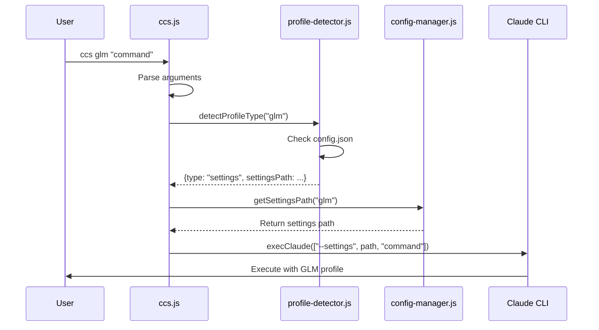

### Account-Based Profile Execution Flow (Concurrent Sessions)

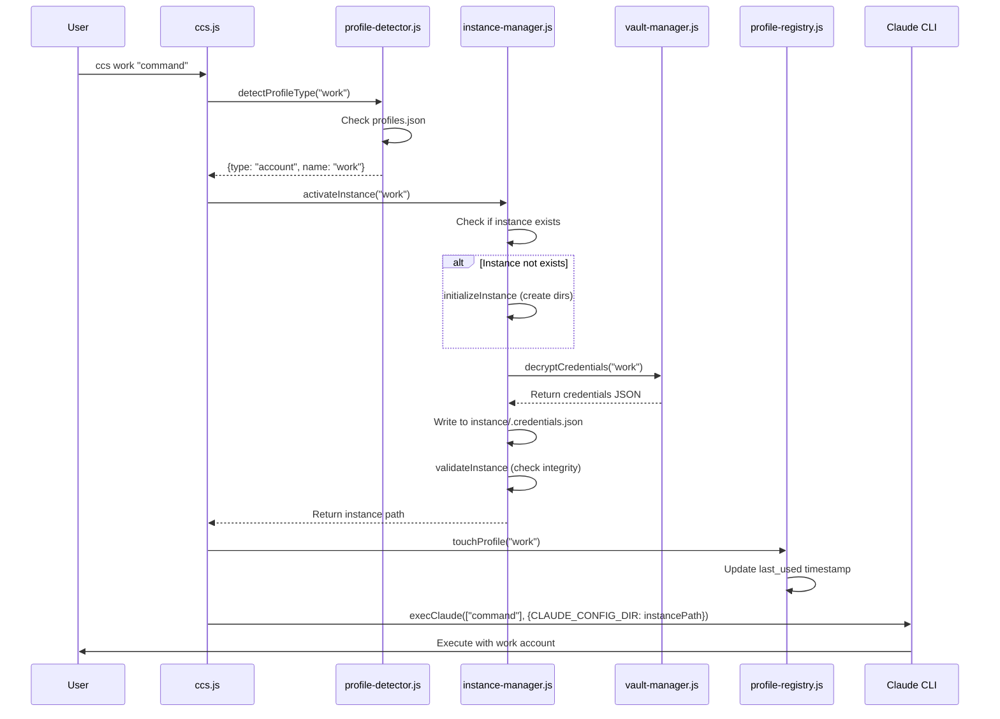

### Special Command Flow

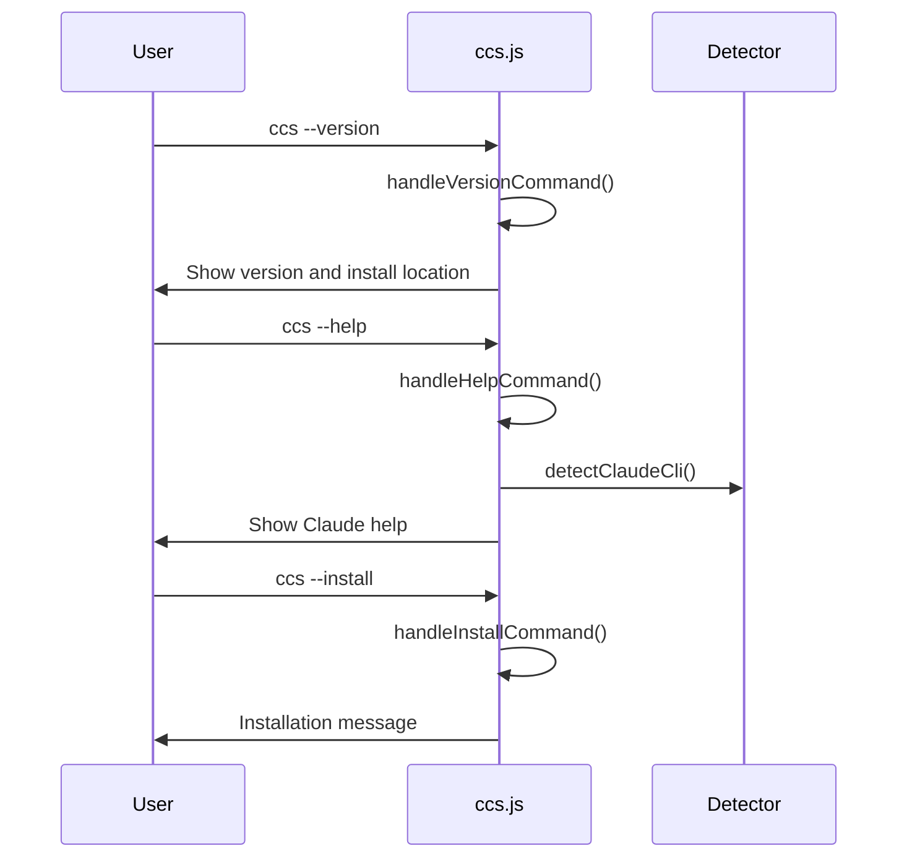

## Configuration Architecture

### File Structure

```
~/.ccs/
├── config.json              # Settings-based profile mappings (glm, glmt, kimi)
├── profiles.json            # Account-based profile metadata (work, personal)
├── glm.settings.json        # GLM configuration (Anthropic endpoint)
├── glmt.settings.json       # GLMT configuration (v3.3.0 with thinking mode)
├── kimi.settings.json       # Kimi configuration
├── config.json.backup       # Single backup file
├── VERSION                  # Version information
├── logs/                    # Debug logs (CCS_DEBUG_LOG=1)
│   ├── {timestamp}-request-anthropic.json
│   ├── {timestamp}-request-openai.json
│   ├── {timestamp}-response-openai.json
│   └── {timestamp}-response-anthropic.json
├── delegation-sessions/     # Delegation session persistence (v4.0+)
│   ├── glm-last.json
│   ├── kimi-last.json
│   └── work-last.json
├── shared/                  # Shared across all profiles (v4.1+)
│   ├── commands/            # Slash commands
│   ├── skills/              # Agent skills
│   └── agents/              # Agent configs
└── instances/               # Isolated Claude instances
    ├── work/                # Work account instance
    │   ├── .claude/
    │   │   ├── commands@ → ~/.ccs/shared/commands/   # Symlink (v4.1+)
    │   │   ├── skills@ → ~/.ccs/shared/skills/       # Symlink (v4.1+)
    │   │   ├── agents@ → ~/.ccs/shared/agents/       # Symlink (v4.1+)
    │   │   ├── settings.json                          # Profile-specific
    │   │   ├── sessions/                              # Profile-specific
    │   │   ├── todolists/                             # Profile-specific
    │   │   └── logs/                                  # Profile-specific
    │   ├── .anthropic/
    │   └── .credentials.json
    └── personal/            # Personal account instance
        ├── .claude/
        │   ├── commands@ → ~/.ccs/shared/commands/
        │   ├── skills@ → ~/.ccs/shared/skills/
        │   ├── agents@ → ~/.ccs/shared/agents/
        │   ├── settings.json
        │   ├── sessions/
        │   └── logs/
        ├── .anthropic/
        └── .credentials.json

src/                         # TypeScript source files (Phase 02 Modular Architecture)
├── ccs.ts                   # Main entry point (593 lines, 44.6% reduction)
├── commands/                # Modular command handlers (Phase 02)
│   ├── version-command.ts          # 3.0KB - Version display
│   ├── help-command.ts            # 4.9KB - Help system
│   ├── install-command.ts         # 957B - Install/uninstall
│   ├── doctor-command.ts          # 415B - System diagnostics
│   ├── sync-command.ts            # 1.0KB - Configuration sync
│   └── shell-completion-command.ts # 2.1KB - Shell completion
├── auth/                    # Authentication system
│   ├── auth-commands.ts
│   ├── profile-detector.ts
│   └── profile-registry.ts
├── delegation/              # AI delegation system
│   ├── delegation-handler.ts
│   ├── headless-executor.ts
│   ├── session-manager.ts
│   ├── result-formatter.ts
│   └── settings-parser.ts
├── glmt/                    # GLMT thinking mode system
│   ├── glmt-proxy.ts
│   ├── glmt-transformer.ts
│   ├── locale-enforcer.ts
│   ├── reasoning-enforcer.ts
│   ├── sse-parser.ts
│   └── delta-accumulator.ts
├── management/              # System management
│   ├── doctor.ts
│   ├── instance-manager.ts
│   ├── shared-manager.ts
│   ├── sync.ts
│   └── recovery-manager.ts
├── utils/                   # Cross-platform utilities
│   ├── claude-detector.ts
│   ├── claude-dir-installer.ts
│   ├── claude-symlink-manager.ts
│   ├── delegation-validator.ts
│   ├── shell-executor.ts            # 1.5KB - Phase 02 NEW
│   ├── package-manager-detector.ts # 3.8KB - Phase 02 NEW
│   ├── shell-completion.ts
│   ├── update-checker.ts
│   ├── helpers.ts
│   └── error-manager.ts
├── types/                   # TypeScript type definitions
│   ├── cli.ts
│   ├── config.ts
│   ├── delegation.ts
│   ├── glmt.ts
│   ├── utils.ts
│   └── index.ts
└── scripts/                 # Build and utility scripts

config/
└── base-glmt.settings.json  # GLMT template (v3.3.0)

scripts/
└── postinstall.js           # Auto-configuration + migration
```

### Configuration Schema

```json
{
  "profiles": {
    "default": "~/.claude/settings.json",
    "glm": "~/.ccs/glm.settings.json"
  }
}
```

### Settings File Format

**GLM Settings (Anthropic endpoint)**:
```json
{
  "env": {
    "ANTHROPIC_BASE_URL": "https://api.z.ai/api/anthropic",
    "ANTHROPIC_AUTH_TOKEN": "your_api_key",
    "ANTHROPIC_MODEL": "glm-4.6",
    "ANTHROPIC_DEFAULT_OPUS_MODEL": "glm-4.6",
    "ANTHROPIC_DEFAULT_SONNET_MODEL": "glm-4.6",
    "ANTHROPIC_DEFAULT_HAIKU_MODEL": "glm-4.6"
  }
}
```

**GLMT Settings (v3.3.0 with thinking mode)**:
```json
{
  "env": {
    "ANTHROPIC_BASE_URL": "https://api.z.ai/api/coding/paas/v4/chat/completions",
    "ANTHROPIC_AUTH_TOKEN": "your_api_key",
    "ANTHROPIC_MODEL": "glm-4.6",
    "ANTHROPIC_DEFAULT_OPUS_MODEL": "glm-4.6",
    "ANTHROPIC_DEFAULT_SONNET_MODEL": "glm-4.6",
    "ANTHROPIC_DEFAULT_HAIKU_MODEL": "glm-4.6",
    "ANTHROPIC_TEMPERATURE": "0.2",
    "ANTHROPIC_MAX_TOKENS": "65536",
    "MAX_THINKING_TOKENS": "32768",
    "ENABLE_STREAMING": "true",
    "ANTHROPIC_SAFE_MODE": "false",
    "API_TIMEOUT_MS": "3000000"
  },
  "alwaysThinkingEnabled": true
}
```

**[i] Note**: All env values are strings (not booleans/numbers) for PowerShell compatibility.

## Security Architecture

### Inherent Security Model

1. **No Shell Injection Risk**: Uses `spawn()` with array arguments
2. **No Arbitrary Code Execution**: No `eval()` or dynamic code generation
3. **Controlled File Access**: Only accesses known configuration locations
4. **Minimal Dependencies**: Reduces attack surface

### Removed Security Measures

The simplification removed several "security theater" measures that provided no real security benefit:

- **Shell argument escaping**: Unnecessary with spawn() arrays
- **Path name validation**: Redundant with proper file system checks
- **Profile name sanitization**: Excessive validation for controlled input

### Maintained Security Controls

- **File existence validation**: Essential for preventing errors
- **JSON parsing safety**: Prevents malformed configuration crashes
- **Path traversal protection**: Maintained through path normalization
- **Executable validation**: Ensures found executables are actually executable

## Platform Architecture

### Cross-Platform Compatibility

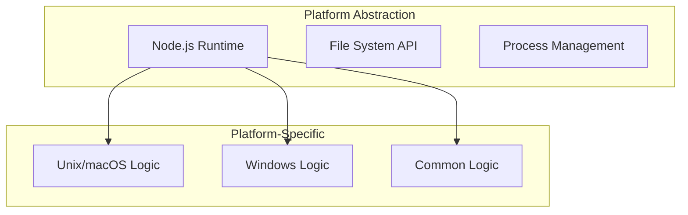

### Platform-Specific Behaviors

**Unix/macOS**:
- Uses `which` command for executable detection
- POSIX path handling and permissions
- Standard Unix terminal TTY detection

**Windows**:
- Uses `where.exe` for executable detection
- Windows path separator handling
- PowerShell compatibility considerations

**Common**:
- Node.js cross-platform APIs
- Unified error handling
- Consistent configuration format

## Performance Architecture

### Optimization Strategies

1. **Reduced Function Call Overhead**: Eliminated redundant validation layers
2. **Simplified Error Handling**: Direct error propagation without complex formatting
3. **Optimized Path Resolution**: Cached environment variable lookups
4. **Minimal Memory Footprint**: 35% reduction in code size

### Performance Characteristics

- **Startup Time**: Fast due to minimal module loading
- **Execution Time**: Direct process spawning without overhead
- **Memory Usage**: Small footprint with efficient data structures
- **I/O Operations**: Optimized configuration reading and caching

## Testing Architecture

### Test Organization

```
tests/
├── shared/
│   ├── unit/           # Unit tests for individual modules
│   └── fixtures/       # Test data and configurations
├── npm/               # npm package-specific tests
└── edge-cases.sh      # Comprehensive scenario testing
```

### Test Coverage Strategy

- **Unit Tests**: Individual module functionality
- **Integration Tests**: Cross-module interaction
- **Platform Tests**: OS-specific behavior validation
- **Edge Case Tests**: Error conditions and unusual scenarios

## Deployment Architecture

### npm Package Distribution

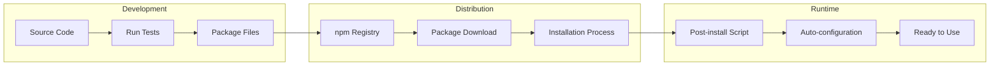

### Installation Process

**Two installation methods available:**

**Method 1: npm Package (Recommended)**
1. **Package Download**: User installs via npm/yarn/pnpm/bun
2. **Post-install Script** (`scripts/postinstall.js`):
   - Creates `~/.ccs/` directory structure
   - Creates `~/.ccs/shared/` (commands, skills, agents)
   - Migrates from v3.1.1 → v3.2.0 (if needed)
   - Migrates GLMT configs from v3.2.0 → v3.3.0 (adds new fields)
   - Creates `config.json` (glm, glmt, kimi, default)
   - Creates `glm.settings.json` (Anthropic endpoint)
   - Creates `glmt.settings.json` (OpenAI endpoint + thinking mode)
   - Creates `kimi.settings.json` (Kimi endpoint)
   - Creates `~/.claude/settings.json` (if missing)
   - Validates configuration (checks JSON syntax, file existence)
   - Shows API key setup instructions
3. **Path Configuration**: npm automatically adds to PATH
4. **Ready State**: System ready for profile switching

**Method 2: Native Installers (v4.5.0)**
1. **Requirements Check**: Validates Node.js 14+ available
2. **Bootstrap Installation**:
   - Installs lightweight shell wrappers (lib/ccs, lib/ccs.ps1)
   - Shell wrappers delegate to Node.js via npx on first run
   - No shell dependencies (error-codes, progress-indicator, prompt removed)
3. **First Run**: Bootstrap auto-installs @kaitranntt/ccs npm package globally
4. **Completion Message**: Shows requirements section with Node.js version

**Requirements (v4.5.0+)**:
- Node.js 14+ (checked during install, enforced by bootstrap)
- npm 5.2+ (for npx, comes with Node.js 8.2+)

**Idempotency**: Safe to run multiple times, preserves existing configs

**Migration Logic** (v3.3.0):
```javascript
// Auto-adds missing fields to existing GLMT configs
const envDefaults = {
  ANTHROPIC_TEMPERATURE: '0.2',
  ANTHROPIC_MAX_TOKENS: '65536',
  MAX_THINKING_TOKENS: '32768',
  ENABLE_STREAMING: 'true',
  ANTHROPIC_SAFE_MODE: 'false',
  API_TIMEOUT_MS: '3000000'
};
```

## Concurrent Sessions Architecture ()

### CLAUDE_CONFIG_DIR Mechanism

CCS uses the undocumented `CLAUDE_CONFIG_DIR` environment variable to isolate Claude CLI instances:

```javascript
// Settings-based profile (backward compatible)
execClaude(claudeCli, ['--settings', settingsPath, ...args]);

// Account-based profile (concurrent sessions)
const envVars = { CLAUDE_CONFIG_DIR: instancePath };
execClaude(claudeCli, args, envVars);
```

**How it works**:
1. Claude CLI reads `CLAUDE_CONFIG_DIR` env var
2. If set, uses that directory instead of `~/.claude/`
3. All state (sessions, todos, logs) stored in instance directory
4. Each profile gets isolated state → concurrent sessions possible

### Isolation Guarantees

**Isolated per instance**:
- Credentials (`.credentials.json`)
- Chat sessions (`session-env/`)
- Todo lists (`todos/`)
- Execution logs (`logs/`)
- File edit history (`file-history/`)
- Shell snapshots (`shell-snapshots/`)

**Shared across instances**:
- Claude CLI binary location
- CCS configuration (`~/.ccs/config.json`, `profiles.json`)
- Encrypted credential vaults (`~/.ccs/accounts/`)

### Concurrent Sessions Workflow

```mermaid
graph TD
    subgraph "Terminal 1"
        T1[ccs work "task1"]
        I1[Instance: ~/.ccs/instances/work/]
        C1[CLAUDE_CONFIG_DIR=work]
        CLI1[Claude CLI Process 1]
    end

    subgraph "Terminal 2"
        T2[ccs personal "task2"]
        I2[Instance: ~/.ccs/instances/personal/]
        C2[CLAUDE_CONFIG_DIR=personal]
        CLI2[Claude CLI Process 2]
    end

    T1 --> I1 --> C1 --> CLI1
    T2 --> I2 --> C2 --> CLI2
```

### Known Limitations ()

1. **Same Profile Concurrent Access**: Running `ccs work` in 2 terminals → file conflicts
   - Not blocked in 
   - File locking considered for future versions

2. **CLAUDE_CONFIG_DIR Reliability**: Undocumented env var
   - May not work on all systems
   - Claude CLI version dependencies unknown
   - No official support from Anthropic

3. **Disk Space**: Each instance ~200-700 KB
   - Sessions accumulate over time
   - No automatic cleanup in 

## Future Extensibility

### Extension Points

The architecture provides clean extension points:

1. **New Profile Types**: Easy addition via ProfileDetector
2. **Additional Commands**: Straightforward command handler extension
3. **Enhanced Isolation**: File locking for same-profile concurrent access
4. **Instance Cleanup**: Automatic session/log cleanup policies
5. **Plugin System**: Clean architecture supports future plugins

### Architectural Guarantees

- **Backward Compatibility**: Settings-based profiles (glm, kimi) work unchanged
- **Performance**: Lazy instance initialization minimizes overhead
- **Maintainability**: Clear separation between settings-based and account-based paths
- **Reliability**: Encrypted vaults + isolated instances reduce failure coupling

## Summary

The CCS system architecture successfully balances simplicity with enhanced functionality:

**Core Architecture Strengths**:
- **Modular Design**: Clear subsystem separation (auth, delegation, glmt, management, utils, commands)
- **Phase 02 Command Modularity**: 6 specialized command handlers with single responsibility principle
- **Unified spawn logic** eliminates code duplication
- **Dual-path execution** supports settings-based and account-based profiles
- **Isolated Claude instances** enable concurrent sessions via CLAUDE_CONFIG_DIR
- **Cross-platform compatibility** ensures consistent behavior everywhere
- **Clean separation of concerns** makes the codebase maintainable and extensible

**v4.3.2 Features** (Current):
- **AI Delegation System**: Headless execution with stream-JSON output, real-time tool tracking
- **Selective Symlinking**: Share .claude/ directories (commands, skills, agents) across profiles
- **Shell Completion**: 4 shells supported (Bash, Zsh, Fish, PowerShell) with color-coded categories
- **Diagnostics**: Doctor, sync, update commands for health checks
- **Session Persistence**: `:continue` support for follow-up delegation tasks
- **13+ Claude Code Tools**: Bash, Read, Write, Edit, Glob, Grep, TodoWrite, etc.

**v3.3.0 Features** (GLMT):
- **GLMT thinking mode**: Embedded proxy for GLM reasoning support
- **Debug logging**: File-based logging to `~/.ccs/logs/` when `CCS_DEBUG_LOG=1`
- **Verbose mode**: Console logging with `--verbose` flag
- **Configuration migration**: Auto-upgrade configs with new fields
- **Enhanced settings**: Temperature, max tokens, thinking controls, API timeout

**Phase 02 Architecture Highlights** (2025-11-27):
1. **Modular Command Architecture**: 6 specialized command handlers with single responsibility
2. **44.6% Main File Reduction**: src/ccs.ts reduced from 1,071 to 593 lines
3. **Enhanced Maintainability**: Focused modules for version, help, install, doctor, sync, shell-completion
4. **New Utility Modules**: Cross-platform shell execution and package manager detection
5. **TypeScript Excellence**: 100% type coverage across all new modules

**v4.3.2 Architecture Highlights**:
1. **Delegation Architecture**: Stream-JSON parsing, session management, result formatting
2. **Symlinking Architecture**: Selective sharing with Windows fallback
3. **Shell Completion**: Dynamic profile-aware completions with color-coding
4. **Diagnostics Infrastructure**: Doctor validation, sync repairs, update checking
5. **Modular Subsystems**: 8 clear subsystems including Phase 02 commands

**Evolution Path**:
- **v2.x → v3.0**: 40% reduction through vault removal, login-per-profile model
- **v3.0 → v4.x**: Enhanced capabilities with delegation, symlinking, diagnostics (zero breaking changes)
- **v4.x → Phase 02**: Modular command architecture with 44.6% main file reduction
- **Future (v5.0+)**: AI-powered features, enterprise capabilities, ecosystem expansion

The architecture demonstrates how thoughtful design can add sophisticated AI delegation capabilities, shared data management, and comprehensive diagnostics while maintaining simplicity, backward compatibility, and cross-platform support.